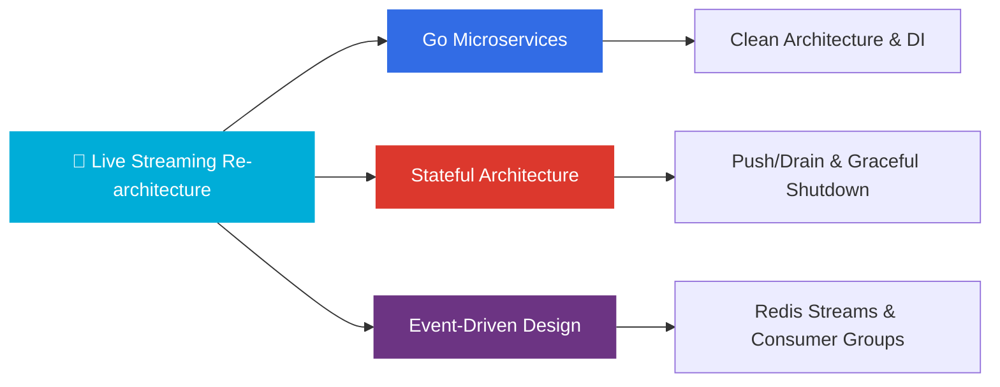

---

### About me

I'm **Kenichi** — a software engineer specializing in **distributed systems** and **stateful architecture**.

Currently at **DeNA**, re-architecting a live streaming platform with **high concurrent connections** — migrating from a Rails monolith to a **Go + Kubernetes** microservice architecture with in-memory state management, gRPC bidirectional streaming, and Redis Streams event-driven messaging.

<br>

### Tech Stack

<table>
  <tr>
    <td><b>Languages</b></td>
    <td>
      
      
      
      
      
      
    </td>
  </tr>
  <tr>
    <td><b>Backend</b></td>
    <td>
      
      
      
      
      
    </td>
  </tr>
    <tr>
    <td><b>Frontend</b></td>
    <td>
      
      
      
      
    </td>
  </tr>
  <tr>
    <td><b>Infrastructure</b></td>
    <td>
      
      
      
      
      
    </td>
  </tr>
  <tr>
    <td><b>Data & Messaging</b></td>
    <td>
      
      
      
      
      
    </td>
  </tr>
  <tr>
    <td><b>Observability</b></td>
    <td>
      
      
      
      
    </td>
  </tr>
</table>

<br>

### Architecture Expertise

```
🏗️  Stateful Architecture     In-memory state, Push/Drain, Graceful Shutdown
📡  Event-Driven Systems      Redis Streams, Consumer Groups, Request-Reply
🔀  Service Mesh & Discovery  Broker patterns, Sticky Routing, Rebalancing
🔍  Observability             pprof, Memory Leak Detection, Performance Tuning
⚡  Real-time Communication   gRPC Bidirectional Streaming, WebSocket, Long-polling
```

<br>

### Current Focus (2026)



<br>

<p>
  <a href="https://blog-tech-livid.vercel.app/">
    
  </a>
  <a href="https://www.linkedin.com/in/kenichi-noshian/">
    
  </a>
</p>
